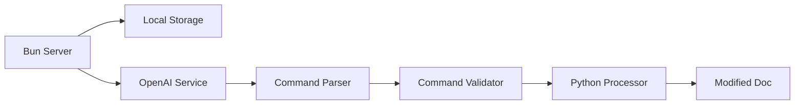

# YellowPad Implementation Plan

## Architecture



## Components

### 1. Bun HTTP Server (`/src/api`)

- File upload handling
- Process management
- Status tracking
- Error handling

```typescript
interface InsertionRequest {
  document: File;
  instructions: string;
  formatting?: {
    bold?: boolean;
    underline?: boolean;
  };
}

interface ProcessingStatus {
  id: string;
  status: 'processing' | 'completed' | 'failed';
  result?: {
    document?: string;
    error?: string;
  };
}
```

### 2. OpenAI Service (`/src/llm`)

- Natural language instruction parsing
- Command generation and validation
- Command explanation

```typescript
interface DocumentCommand {
  documentId: string;
  action: 'insert' | 'modify' | 'delete';
  location: {
    type: 'heading' | 'section' | 'sentence' | 'paragraph';
    value?: string;
    number?: string | number;
    position: 'before' | 'after' | 'replace' | 'start' | 'end';
    matchText?: string;
    matchLevel?: boolean;
  };
  content?: {
    text: string;
    style: {
      matchSource?: boolean;
      specific?: {
        bold?: boolean;
        italic?: boolean;
        underline?: boolean;
        // ... other style properties
      };
    };
  };
}

class OpenAIService {
  async parseInstructions(text: string): Promise<DocumentCommand[]>;
  async validateCommand(command: DocumentCommand): Promise<ValidationResult>;
  async explainCommand(command: DocumentCommand): Promise<string>;
}
```

### 3. Python Processor (`/src/processor`)

- Document parsing
- Command execution
- Style matching
- Content insertion

```python
class DocumentProcessor:
    def __init__(self, doc_path: str):
        self.doc = Document(doc_path)

    def execute_commands(
        self,
        commands: List[Dict],
    ) -> str:
        # Implementation
        pass

    def _analyze_styles(self) -> dict:
        # Implementation
        pass

    def _execute_command(self, command: Dict) -> None:
        # Implementation
        pass
```

## Local Development Setup

### Requirements

- Bun >= 1.0
- Python >= 3.8
- python-docx
- OpenAI API key

### Development Environment

```bash
# Install dependencies
bun install
pip install python-docx openai

# Set environment variables
export OPENAI_API_KEY=your_key_here

# Start development
bun dev
```

## File Structure

```
/
├── src/
│   ├── api/
│   │   ├── index.ts        # Main server
│   │   └── routes.ts       # Route handlers
│   ├── llm/
│   │   ├── openai.ts       # OpenAI service
│   │   └── openai.test.ts  # LLM tests
│   ├── processor/
│   │   ├── processor.py    # Document processing
│   │   └── utils.py        # Helper functions
│   └── types/
│       └── index.ts        # TypeScript types
├── test/
│   ├── api.test.ts
│   └── processor.test.py
└── package.json
```

## Dependencies

```json
{
  "dependencies": {
    "@types/node": "^20.0.0",
    "openai": "^4.0.0"
  },
  "devDependencies": {
    "bun-types": "latest"
  }
}
```

## Error Handling

1. **API Layer**

   - Invalid file types
   - Processing failures
   - Timeout handling
   - Invalid instructions

2. **LLM Layer**

   - API failures
   - Invalid command generation
   - Validation errors
   - Rate limiting

3. **Processor**
   - Document parsing errors
   - Command execution failures
   - Style matching issues
   - Invalid state handling

## Testing Strategy

1. **Unit Tests**

   - API endpoint tests
   - LLM parsing tests
   - Command validation tests
   - Document processing tests
   - Error handling tests

2. **Integration Tests**
   - End-to-end flow
   - File processing
   - LLM integration
   - Error scenarios

## Local Development Workflow

1. **Setup**

   ```bash
   # Install dependencies
   bun install
   pip install python-docx openai

   # Set environment variables
   export OPENAI_API_KEY=your_key_here

   # Start server
   bun dev
   ```

2. **Testing**

   ```bash
   # Run API tests
   bun test

   # Run processor tests
   python -m pytest
   ```

3. **Debugging**
   - Bun debugger
   - Python debugger
   - Console logging
   - LLM response inspection
